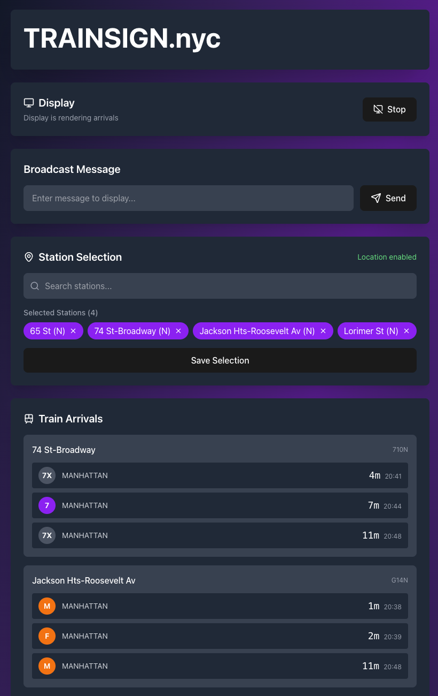

## TRAINSIGN.nyc 
RGB panel for fun and games, showing MTA train times and other messages, games and stuff.

### Components
Raspberry pi - Runs python application 
 * python flask api, runs as a daemon 
 * [rpi-rgb-led-matrix](https://github.com/hzeller/) is compiled with python bindings rpi-rgb-led-matrix
 * Adafruit RGB matrix hat for connecting dasiy chained rgb panels
 * React based web ui for control and configuration

## Features

### Web UI
 * Configure stops
 * Send Broadcast messages

 